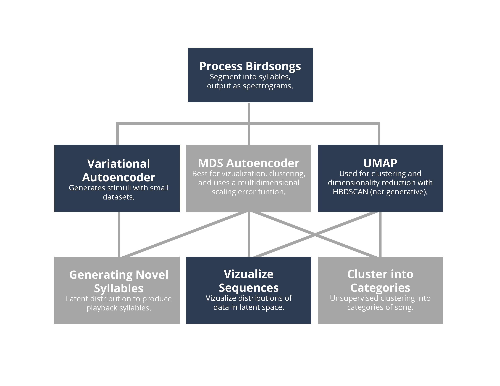
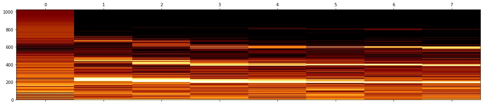

Animal Vocalization Generative Network (AVGN)
---
Cowbird notebook by **Carol Li** (Undergraduate, University of Pennsylvania, Schmidt Laboratory).

Original repository by **Tim Sainburg** (PhD student, UCSD, Gentner Laboratory).

---

The cowbird encoding network takes cowbird song, segments to filter out noise in recordings and into syllables of birdsong, learns and trains a generative model of segments of vocalizations, and uses the learned latent representations to cluster syllables, generate novel syllables, and visualize clustered sequences used for interpolation.

Overview of the package
------------

## Syllabification
Below is an example of a transcribed cowbird song.

TODO: 
- Latent space generative modelling of song
- Example grid sampling from cowbird song (from a 2D Multidimensional Scaling Autoencoder) --> debug
- Example interpolation of cowbird song (from a 16D Variational Autoencoder)
- Example of transcribed cowbird song

Documentation
------------
Notebook is located in `notebooks/birdsong/brown_headed_cowbird` folder. 

GAIA autoencoder is not yet implemented.

Installation
------------

to install run python `setup.py install`

---

Data references
------------

Hedley, Richard (2016): Data used in PLoS One article “Complexity, Predictability and Time Homogeneity of Syntax in the Songs of Cassin’s Vireo (Vireo cassini)” by Hedley (2016). figshare. https://doi.org/10.6084/m9.figshare.3081814.v1

Katahira K, Suzuki K, Kagawa H, Okanoya K (2013) A simple explanation for the evolution of complex song syntax in Bengalese finches. Biology Letters 9(6): 20130842. https://doi.org/10.1098/rsbl.2013.0842  https://datadryad.org//resource/doi:10.5061/dryad.6pt8g

Katahira K, Suzuki K, Kagawa H, Okanoya K (2013) Data from: A simple explanation for the evolution of complex song syntax in Bengalese finches. Dryad Digital Repository. https://doi.org/10.5061/dryad.6pt8g

Arriaga, J. G., Cody, M. L., Vallejo, E. E., & Taylor, C. E. (2015). Bird-DB: A database for annotated bird song sequences. Ecological informatics, 27, 21-25. http://taylor0.biology.ucla.edu/birdDBQuery/

------------

<small>Project based on the <a target="_blank" href="https://drivendata.github.io/cookiecutter-data-science/">cookiecutter data science project template</a>. #cookiecutterdatascience</small>

Original README: https://github.com/timsainb/AVGN/blob/master/README.md
